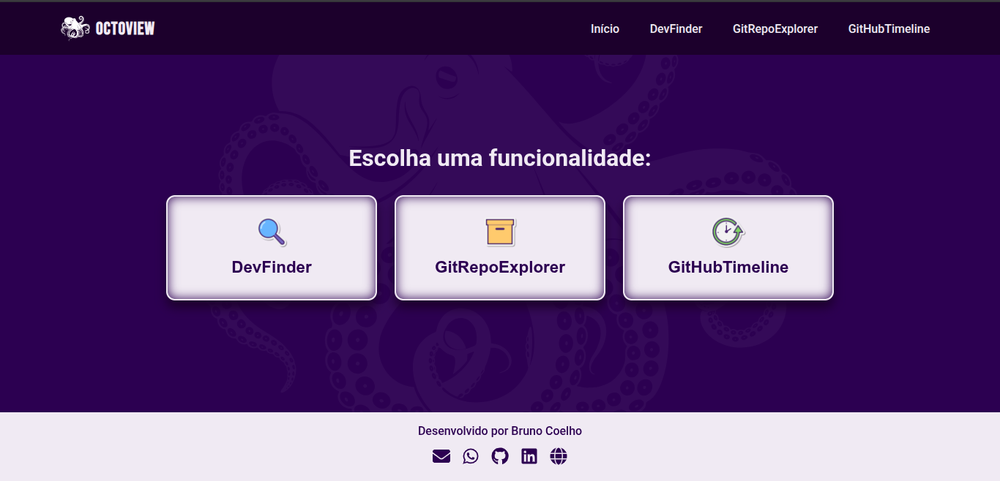

<h1 align="center">
  
  <br />
  OctoView
</h1>

<p align="center">
  🚀 Plataforma React + TypeScript que explora o universo GitHub com estilo. Busque desenvolvedores, repositórios e acompanhe atividades com animações suaves e uma interface moderna!
</p>

<p align="center">
  <a href="https://octoview.netlify.app/" target="_blank"><strong>🔗 Acesse o Deploy</strong></a> • 
  <a href="https://github.com/BMinority/octo-view" target="_blank"><strong>📁 Repositório</strong></a>
</p>

---

## 🧠 Sobre o Projeto

**OctoView** é uma aplicação desenvolvida com React + Vite + TypeScript e estilização em SCSS que consome a [API pública do GitHub](https://docs.github.com/pt/rest) para oferecer três funcionalidades principais:

- 🔎 **DevFinder** — Busque perfis de usuários GitHub.
- 📦 **GitRepoExplorer** — Explore repositórios com filtros e paginação.
- 🕒 **GitHubTimeline** — Veja uma linha do tempo de eventos públicos de um usuário.

A proposta é criar uma ferramenta visualmente moderna e funcional, ideal para quem deseja explorar dados do GitHub com praticidade e performance.

---

## 📸 Screenshots

<p align="center">
  
</p>

---

## ⚙️ Tecnologias Utilizadas

- **React** + **Vite**
- **TypeScript**
- **SASS/SCSS**
- **Framer Motion** (animações)
- **Axios**
- **React Router DOM**
- **React Icons**
- **GitHub REST API**

---

## 🌐 Acesse o Projeto Online

🔗 **Deploy:**  
https://octoview.netlify.app/

---

## 💻 Instalação Local

Clone o projeto no seu ambiente local:

```bash
git clone https://github.com/BMinority/octo-view.git
cd octo-view
npm install
npm run dev
```

## 📁 Estrutura de Pastas

```bash
octo-view/
├── public/
├── src/
│   ├── assets/         # Imagens, logos, ícones
│   ├── components/     # Componentes reutilizáveis
│   ├── pages/          # Páginas principais da aplicação
│   ├── services/       # Serviços de API (GitHub)
│   ├── styles/         # Estilização SCSS modularizada
│   ├── App.tsx
│   └── main.tsx
└── index.html
```

## 🧪 Funcionalidades

| Funcionalidade     | Descrição                                                                |
| ------------------ | ------------------------------------------------------------------------ |
| 🔍 DevFinder       | Pesquisa perfis do GitHub, exibindo avatar, bio, localização, seguidores |
| 📁 GitRepoExplorer | Busca e lista repositórios com paginação e visual detalhado              |
| 📅 GitHubTimeline  | Exibe eventos públicos de um usuário agrupados por data, com filtros     |

## 📱 Responsividade

O layout foi projetado com responsividade total, se adaptando a smartphones, tablets e desktops, mantendo legibilidade e usabilidade em qualquer tamanho de tela.

## 💬 Contato

E-mail: brunocoelho66@gmail.com

LinkedIn: [dev-bcoelho](https://www.linkedin.com/in/dev-bcoelho/)

🌐 [Portfólio](https://brunocoelhodd.vercel.app/)

## 🤝 Contribuição

Contribuições são sempre bem-vindas!
Se quiser sugerir melhorias ou reportar bugs:

```bash
git clone https://github.com/BMinority/octo-view.git
git checkout -b feature/nova-funcionalidade
git commit -m "feat: adicionei nova funcionalidade"
git push origin feature/nova-funcionalidade

```

Depois é só abrir um Pull Request! 😉

## 📝 Licença

Este projeto está sob a licença MIT.
Criado por Bruno Coelho.
